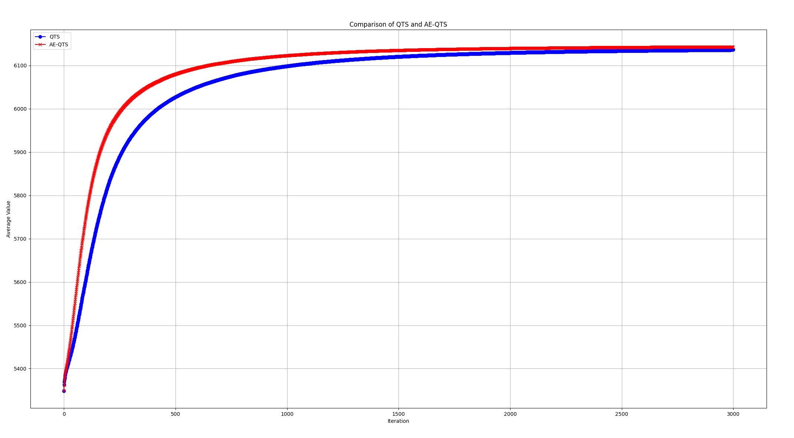

# QTS and AE-QTS solving 0/1 kncpsack problem implemented in Rust

This is a Rust implementation of the QTS and AE-QTS algorithms for solving the 0/1 knapsack problem. The algorithms are described in the following papers:

The implementation is based on the following papers:

- [arXiv - AE-QTS](https://arxiv.org/abs/2311.12867v2)

## Usage

### Configuration

the configuration file is located in `config/config.toml`

### Running the program

```sh
cargo run --release
```


